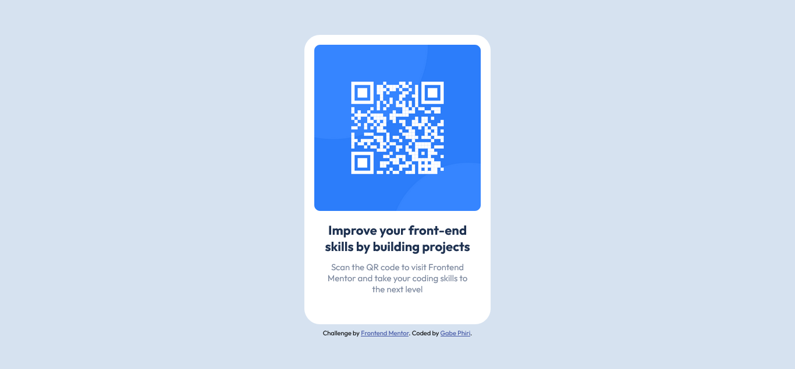

# Frontend Mentor - QR code component solution

This is a solution to the [QR code component challenge on Frontend Mentor](https://www.frontendmentor.io/challenges/qr-code-component-iux_sIO_H). Frontend Mentor challenges help you improve your coding skills by building realistic projects.

## Table of contents

- [Overview](#overview)
  - [Screenshot](#screenshot)
  - [Links](#links)
- [My process](#my-process)
  - [Built with](#built-with)
- [Author](#author)

### Overview

### Screenshot

### Links

- Solution URL: [Frontend Mentor | Solution](https://www.frontendmentor.io/solutions/solution-for-the-qr-code-component-challenge-on-frontend-mentor-MKducrblV9)
- Live Site URL: [QR Code Component](https://aky11taz.github.io/qr-code-component-main/)

## My process

### Built with

- Semantic HTML5 markup
- CSS custom properties

## Author

- Website - [Gabe Phiri](https://www.facebook.com/Official.EmrysCreations")
- Frontend Mentor - [@Aky11Taz](https://www.frontendmentor.io/profile/Aky11Taz)
